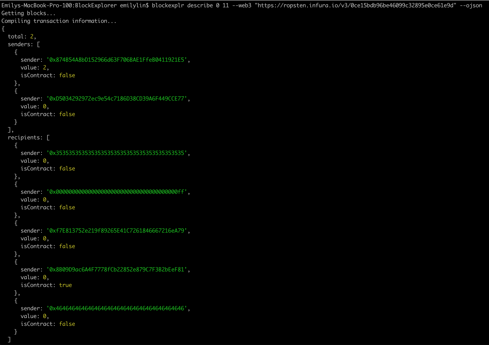
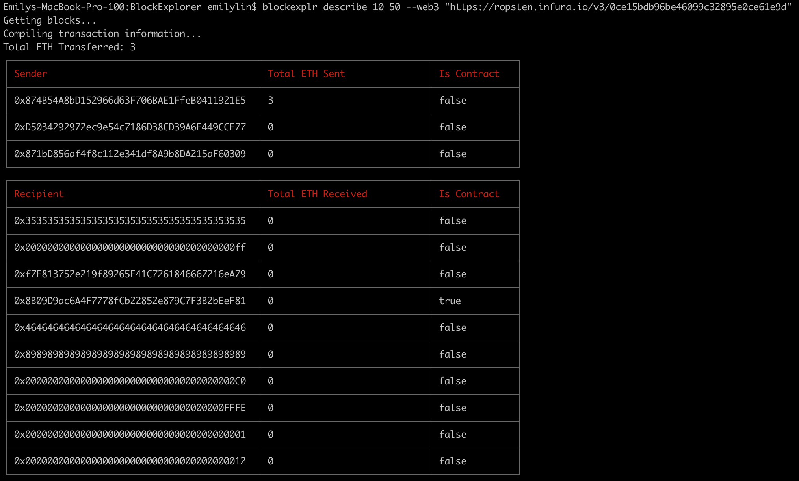

# BlockExplr
This is a simple Ethereum block explorer CLI written in JavaScript using `yargs` and `web3`. With this, you can query transaction data over a set of blocks. You can choose to print out the data in tabular form to the console or return it in a JSON format.

Currenty, the data returned is:
* The total amount of ETH transferred overall
* The total amount of ETH received by an address
* The total amount of ETH sent by an address
* Whether or not the address is a contract

## Installation
`blockexplr` is distributed as a Node.js package via `npm`. Make sure you hae [`Node.js` and `npm`](https://docs.npmjs.com/downloading-and-installing-node-js-and-npm) installed and run
```
npm install blockexplr
```

## Set Up
To get the CLI up and running, you need to pass in a web3 provider. The default option assumes that you have a local blockchain instance running using `ganache` on `http://localhost:7545`. Follow these [instructions](https://trufflesuite.com/docs/ganache/quickstart.html) to set that up.

If you want to connect to other public testnets such as ropsten, you can set up the provider using [`infura`](https://blog.infura.io/getting-started-with-infura-28e41844cc89/). You would then pass that in through the `web3` flag as `https://ropsten.infura.io/v3/[infura_project_id]`

## Usage
```
blockexplr <command>

A simple blockchain explorer

Commands:
  blockexplr describe <start> [end]  Provides a report on transaction data over
                                     a range of blocks

Options:
  --version  Show version number                                       [boolean]
  --help     Show help                                                 [boolean]
```

```
blockexplr describe <start> [end]

Provides a report on transaction data over a range of blocks

Positionals:
  start  If end is unspecified, this represents how farback from the present
         block the data should be queried                   [number] [required]
  end    If specified, start and end represent the range (inclusive) over which
         data should be queried                                         [number]

Options:
  --version               Show version number                          [boolean]
  --help                  Show help                                    [boolean]
  --web3, --web3Provider  The web3 provider. Default is ganache.
                                     [string] [default: "http://localhost:7545"]
  --ojson                 Outputs data in json format [boolean] [default: false]
```
## Examples
Querying data over a range of blocks formatted as JSON

Querying data over a range of blocks formatted as a table


## Further Improvements
Processing over a large range of blocks or long lists of transaction data can get slow. As of right now, the code iterates over each transaction for each block one by one, while also making another query to determine whether an address is a contract or not. This can probably be sped up by processing each block asynchronously (with some maximum number of threads) and making batch requests.

Some further features I might add:
* Support for the bitcoin blockchain
* Query a specific block by hash
* Including a --verbose flag to expose more summary information (i.e., contracts by percentage, number of uncles)
* Presenting the data in UI instead of CLI
* More robust error handling
